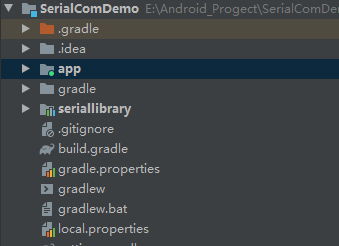
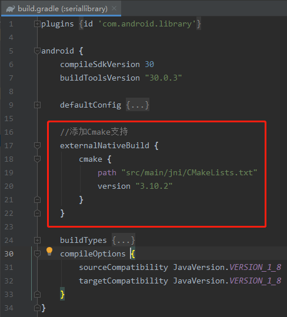
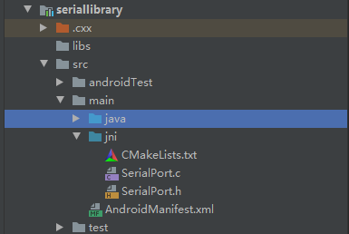
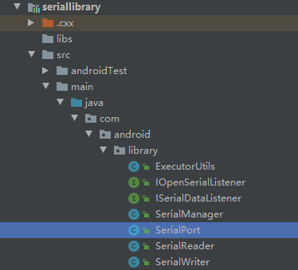
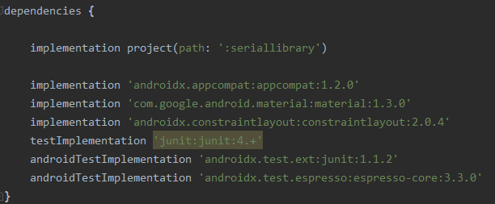
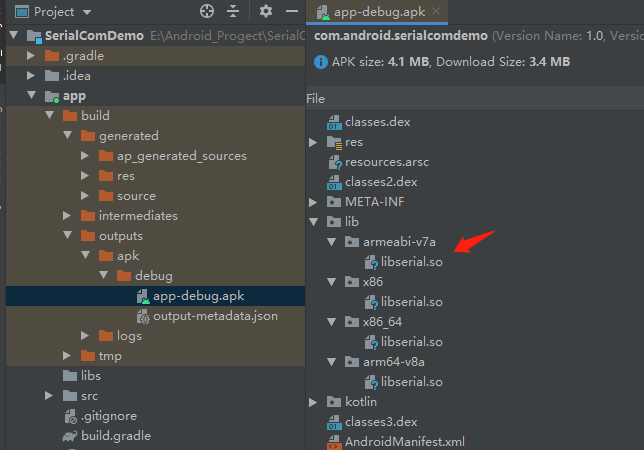
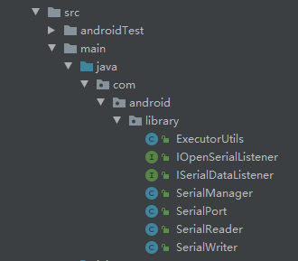

## 串口通讯

### 引言

​       对于安卓开发的小伙伴来说，很少用到串口通信开发。主要用来外接一些硬件设备，例如扫码器，读卡器，体温枪等一些硬件设备。这些设备与安卓之间通过串口来交换数据。

### 1.基本概念

**串口的概念：**用串行通信方式的扩展接口，指数据一位一位地顺序传送。

**串口操作相关参数：**

- 1.设备名（串口地址）：安卓是基于Linux系统，所以通常的串口地址为：/dev/ttyS0，/dev/ttyS1..... 等。可通过linux命令查看对应的串口状态。

- 2.波特率：串口传输速率，用来衡量数据传输的快慢，即单位时间内载波参数变化的次数。波特率与距离成反比，波特率越大传输距离相应的就越短。

- 3.数据位：衡量通信中实际数据位的参数。当计算机发送一个信息包，实际的数据往往不会是8位的，标准的值是6、7和8位。如何设置取决于你想传送的信息。

- 4.停止位：用于表示单个包的最后一位。

- 5.校验位：在串口通信中一种简单的检错方式。有四种检错方式：偶、奇、高和低。

> 在 google 官方提供的 [demo](https://github.com/cepr/android-serialport-api) 代码基本上能够应付很多在Android设备使用串口的场景，该demo中不支持设置N,8,1。N对应校验位，8对应数据位，1对应停止位。在安卓串口操作中，不需要这三个参数。

### 2.串口通信 lib 准备

> 网上提供的代码都是通过 `ndk` 来编译 jni 文件生成对应的.so库。通过编写 jni 文件来打开串口，获取串口的数据流，来进行相应的读写操作。
>
> 本文通过`CMake`来编译 `jni` 文件生成对应的 so 库文件。

#### 1.创建Android-library库。

##### 1.首先创建：`seriallibrary`库

通常一些独立的功能模块，可能出现复用的情况，通常建议提取到 `library` 中，这样整个工程架构更加清晰明了，非常建议这样做。



##### 2.配置CMake支持

在`seriallibrary`库的 `build.gradle` 中添加依赖：



##### 3.创建 jni 文件

在 `main` 文件夹下创建 `jni` 文件夹，并创建对应的文件：



##### 4.编写 CMakeLists.txt 文件

这里涉及到 `jni` 和 **cmake** 编译相关知识，可以自行查阅 **cmake** 使用教程。

> CMakeLists.txt 文件[配置](https://www.jianshu.com/p/c71ec5d63f0d) 如下：

```tex
cmake_minimum_required(VERSION 3.10.2)

# Declares and names the project.

project("serial_port2")

add_library( # Sets the name of the library.
             serial

             # Sets the library as a shared library.
             SHARED

             # Provides a relative path to your source file(s).
             SerialPort.c)

include_directories(src/main/jni/)

find_library( # Sets the name of the path variable.
        log-lib

        # Specifies the name of the NDK library that
        # you want CMake to locate.
        log )

target_link_libraries( # Specifies the target library.
        serial

        # Links the target library to the log library
        # included in the NDK.
        ${log-lib} )
```

在编写 `jni` 接口时，首先需要创建对应的 java 类及对应的 **native** 方法，创建 `SerialPort.java`文件。



 `SerialPort.java` 类有 `open` 和 `close` 方法，用来打开和关闭串口：

```java
package com.android.library;

import java.io.FileDescriptor;

public class SerialPort {

    /**
     * 打开串口
     * @param path       串口名称
     * @param porterRate 波特率
     * @param flags
     * @return
     */
    private native static FileDescriptor open(String path, int porterRate, int flags);

    /**
     * 关闭串口
     */
    private native void close();

    /**
     * 加载 so 库,该库名称与在 CMakeLists.txt 配置的库名相同
     */
    static {
        System.loadLibrary("serial");
    }
}
```

> open 方法对应的全路径名称为：com.android.library.SerialPort#open

> close 方法对应的全路径名称为：com.android.library.SerialPort#close

> 编写对应的 SerialPort.h 文件：注意 JNICALL 后的方法名不要写错，open 方法路径中的 . 对应__

> com.android.library.SerialPort#open  ->  Java_com_android_library_SerialPort_open

> com.android.library.SerialPort#close  -> Java_com_android_library_SerialPort_close

> SerialPort.h 文件如下：

```c++
/* DO NOT EDIT THIS FILE - it is machine generated */
#include <jni.h>
/* Header for class com.android.library.SerialPort */
#ifndef _Included_com_android_libary_SerialPort
#ifdef __cplusplus
extern "C" {
#endif
/*
 *
 * Method:    open
 * Signature: (Ljava/lang/String;II)Ljava/io/FileDescriptor;
 */
/**
 * Class:      com.android.library.SerialPort
 * Method:    open
 * 对应的jni接口为： com_android_library_SerialPort_open
 */
JNIEXPORT jobject JNICALL Java_com_android_library_SerialPort_open
  (JNIEnv *, jclass, jstring, jint, jint);

/**
 * Class:      com.android.library.SerialPort
 * Method:    open
 * 对应的jni接口为： com_android_library_SerialPort_close
 */
JNIEXPORT void JNICALL Java_com_android_library_SerialPort_close
  (JNIEnv *, jobject);

#ifdef __cplusplus
}
#endif
#endif

```

> `SerialPort.c` 文件如下：除了 `JNICALL` 方法名不同，其它都一样，来自 google 提供的串口工具 demo

```c++
#include <termios.h>
#include <unistd.h>
#include <sys/types.h>
#include <sys/stat.h>
#include <fcntl.h>
#include <string.h>
#include <jni.h>

#include "SerialPort.h"

#include "android/log.h"
static const char *TAG="serial_port";
#define LOGI(fmt, args...) __android_log_print(ANDROID_LOG_INFO,  TAG, fmt, ##args)
#define LOGD(fmt, args...) __android_log_print(ANDROID_LOG_DEBUG, TAG, fmt, ##args)
#define LOGE(fmt, args...) __android_log_print(ANDROID_LOG_ERROR, TAG, fmt, ##args)

static speed_t getBaudrate(jint baudrate)
{
	switch(baudrate) {
	case 0: return B0;
	case 50: return B50;
	case 75: return B75;
	case 110: return B110;
	case 134: return B134;
	case 150: return B150;
	case 200: return B200;
	case 300: return B300;
	case 600: return B600;
	case 1200: return B1200;
	case 1800: return B1800;
	case 2400: return B2400;
	case 4800: return B4800;
	case 9600: return B9600;
	case 19200: return B19200;
	case 38400: return B38400;
	case 57600: return B57600;
	case 115200: return B115200;
	case 230400: return B230400;
	case 460800: return B460800;
	case 500000: return B500000;
	case 576000: return B576000;
	case 921600: return B921600;
	case 1000000: return B1000000;
	case 1152000: return B1152000;
	case 1500000: return B1500000;
	case 2000000: return B2000000;
	case 2500000: return B2500000;
	case 3000000: return B3000000;
	case 3500000: return B3500000;
	case 4000000: return B4000000;
	default: return -1;
	}
}

/*
 * Class:     com.android.library.SerialPort
 * Method:    open
 * Signature: (Ljava/lang/String;II)Ljava/io/FileDescriptor;
 */
JNIEXPORT jobject JNICALL Java_com_android_library_SerialPort_open
  (JNIEnv *env, jclass thiz, jstring path, jint baudrate, jint flags)
{
	int fd;
	speed_t speed;
	jobject mFileDescriptor;

	/* Check arguments */
	{
		speed = getBaudrate(baudrate);
		if (speed == -1) {
			/* TODO: throw an exception */
			LOGE("Invalid baudrate");
			return NULL;
		}
	}

	/* Opening device */
	{
		jboolean iscopy;
		const char *path_utf = (*env)->GetStringUTFChars(env, path, &iscopy);
		LOGD("Opening serial port %s with flags 0x%x", path_utf, O_RDWR | flags);
		fd = open(path_utf, O_RDWR | flags);
		LOGD("open() fd = %d", fd);
		(*env)->ReleaseStringUTFChars(env, path, path_utf);
		if (fd == -1)
		{
			/* Throw an exception */
			LOGE("Cannot open port");
			/* TODO: throw an exception */
			return NULL;
		}
	}

	/* Configure device */
	{
		struct termios cfg;
		LOGD("Configuring serial port");
		if (tcgetattr(fd, &cfg))
		{
			LOGE("tcgetattr() failed");
			close(fd);
			/* TODO: throw an exception */
			return NULL;
		}

		cfmakeraw(&cfg);
		cfsetispeed(&cfg, speed);
		cfsetospeed(&cfg, speed);

		if (tcsetattr(fd, TCSANOW, &cfg))
		{
			LOGE("tcsetattr() failed");
			close(fd);
			/* TODO: throw an exception */
			return NULL;
		}
	}

	/* Create a corresponding file descriptor */
	{
		jclass cFileDescriptor = (*env)->FindClass(env, "java/io/FileDescriptor");
		jmethodID iFileDescriptor = (*env)->GetMethodID(env, cFileDescriptor, "<init>", "()V");
		jfieldID descriptorID = (*env)->GetFieldID(env, cFileDescriptor, "descriptor", "I");
		mFileDescriptor = (*env)->NewObject(env, cFileDescriptor, iFileDescriptor);
		(*env)->SetIntField(env, mFileDescriptor, descriptorID, (jint)fd);
	}

	return mFileDescriptor;
}

/*
 * Class:     cedric_serial_SerialPort
 * Method:    close
 * Signature: ()V
 */
JNIEXPORT void JNICALL Java_com_android_library_SerialPort_close
  (JNIEnv *env, jobject thiz)
{
	jclass SerialPortClass = (*env)->GetObjectClass(env, thiz);
	jclass FileDescriptorClass = (*env)->FindClass(env, "java/io/FileDescriptor");

	jfieldID mFdID = (*env)->GetFieldID(env, SerialPortClass, "mFd", "Ljava/io/FileDescriptor;");
	jfieldID descriptorID = (*env)->GetFieldID(env, FileDescriptorClass, "descriptor", "I");

	jobject mFd = (*env)->GetObjectField(env, thiz, mFdID);
	jint descriptor = (*env)->GetIntField(env, mFd, descriptorID);

	LOGD("close(fd = %d)", descriptor);
	close(descriptor);
}
```

### 2.将 seriallibrary 引入到 app 模块下

在 app 的 build.gradle 文件中引入 `seriallibrary` 库：

> implementation project(path: ':seriallibrary')



编译项目可以打开 debug.apk 看一下：

对应的 `libserial.so`文件已经打包到我们的 lib 中，当然你也可以在 `CMakeLists.txt` 中配置对应的参数，生成需要的 `armeabi-v7a` 等类型。其中  libserial.so 中的 lib 字段是系统自动添加的。



### 3.封装串口方法进行读写操作

java目录如下：



1.`SerialPort.java` 类，获取 `FileDescriptor` 进行 串口操作。

通过 `native` 方法获取 `FileDescriptor` 进而进行 IO 流操作，详细代码：

```java
package com.android.library;

import java.io.File;
import java.io.FileDescriptor;
import java.io.FileInputStream;
import java.io.FileOutputStream;
import java.io.IOException;

public class SerialPort {

    /**
     * Do not remove or rename the field mFd: it is used by native method close();
     */
    private FileDescriptor mFd;
    /**
     * 读数据
     */
    private FileInputStream mFileInputStream;

    /**
     * 写数据
     */
    private FileOutputStream mFileOutputStream;


    public SerialPort(File dev, int porterRate, int flags) throws IOException, SecurityException {
        mFd = open(dev.getAbsolutePath(), porterRate, flags);
        if (mFd == null) {
            throw new IOException();
        }
        mFileInputStream = new FileInputStream(mFd);
        mFileOutputStream = new FileOutputStream(mFd);
    }

    public FileInputStream getFileInputStream() {
        return mFileInputStream;
    }

    public FileOutputStream getFileOutputStream() {
        return mFileOutputStream;
    }

    public void closePort() {
        try {
            if (mFileInputStream != null) {
                mFileInputStream.close();
            }
            if (mFileOutputStream != null) {
                mFileOutputStream.close();
            }
        } catch (IOException e) {
            e.printStackTrace();
        }
        close();
    }


    /**
     * 打开串口
     * @param path       串口名称
     * @param porterRate 波特率
     * @param flags
     * @return
     */
    private native static FileDescriptor open(String path, int porterRate, int flags);

    /**
     * 关闭串口
     */
    private native void close();

    /**
     * 加载 so 库
     */
    static {
        System.loadLibrary("serial");
    }
}

```

2.`ISerialDataListener` 数据监听接口：

```java
public interface ISerialDataListener {

    void onDataReceived(String data);
}
```

3.`IOpenSerialListener` 串口打开结果监听：

```java
public interface IOpenSerialListener {

    void onResult(boolean success,String msg);
}
```

**串口数据读写操作需要在子线程中执行：**

1.`SerialReader` 读取串口数据：

网上参考的代码都是传入一个固定的  byte[] 数组来读取 `InputStream` 数据，会出现数据读取不全等问题。这里进行了优化。

```java
package com.android.library;

import android.os.SystemClock;

import com.blankj.utilcode.util.ConvertUtils;

import java.io.IOException;
import java.io.InputStream;

import static com.android.library.ExecutorUtils.executors;


public class SerialReader implements Runnable {

    private final InputStream mInputStream;
    private final ISerialDataListener mReceiver;
    private boolean mIsInterrupted = false;

    public SerialReader(InputStream inputStream, ISerialDataListener receiver) {
        mInputStream = inputStream;
        mReceiver = receiver;
    }

    @Override
    public void run() {
        InputStream is = mInputStream;
        int available;
        int first;
        try {
            while (!mIsInterrupted && is != null && (first = is.read()) != -1) {
                do {
                    available = is.available();
                    SystemClock.sleep(5);
                } while (available != is.available());
                available = is.available();
                byte[] bytes = new byte[available + 1];
                is.read(bytes, 1, available);
                bytes[0] = (byte) (first & 0xFF);
                report(bytes);
            }
        } catch (IOException e) {
            e.printStackTrace();
            return;
        }
    }

    private void report(final byte[] data) {
        executors.execute(() -> {
            //直接用的 blankj 库 将 16 进制转成 string
            String temp = ConvertUtils.bytes2HexString(data);
            mReceiver.onDataReceived(temp);
        });
    }
}
```

2.`SerialWriter` 向串口写入数据

```java
package com.android.library;

import com.blankj.utilcode.util.ConvertUtils;

import java.io.IOException;
import java.io.OutputStream;

import static com.android.library.ExecutorUtils.executors;


public class SerialWriter {

    private final OutputStream mOutputStream;

    public SerialWriter(OutputStream outputStream){
        mOutputStream = outputStream;
    }

    public void write(String data) {
        executors.execute(() -> {
            try {
                byte[] temp = ConvertUtils.hexString2Bytes(data);
                mOutputStream.write(temp);
                mOutputStream.flush();
            } catch (IOException e) {
                e.printStackTrace();
            }
        });
    }
}
```

3.`ExecutorUtils` 线程池

```java
package com.android.library;

import java.util.concurrent.ExecutorService;
import java.util.concurrent.Executors;

/**
 * 线程池工具
 */
public class ExecutorUtils {

    public final static ExecutorService executors = Executors.newCachedThreadPool();
}
```

4.`SerialManager` 单例类来管理串口操作

```java
package com.android.library;

import android.util.Log;

import java.io.File;
import java.io.IOException;
import java.util.ArrayList;
import java.util.List;
import java.util.concurrent.ExecutorService;
import java.util.concurrent.Executors;

import static com.android.library.ExecutorUtils.executors;

/**
 * author : shengping.tian
 * time   : 2021/03/10
 * desc   : 串口管理工具类
 * version: 1.0
 */
public class SerialManager implements ISerialDataListener {

    private volatile SerialPort mPort;

    private static final String TAG = "SerialManager";

    private SerialWriter mWriter;

    private List<ISerialDataListener> mListenerList = new ArrayList<>();

    private SerialManager() {

    }

    private static final SerialManager instance = new SerialManager();

    public static SerialManager getInstance() {
        return instance;
    }


    public void openSerialPort(String portName, int porterRate, IOpenSerialListener listener) {
        executors.execute(() -> {
            if (mPort == null) {
                Log.d(TAG, "first init open serial");
                try {
                    mPort = new SerialPort(new File(portName), porterRate, 0);
                    mWriter = new SerialWriter(mPort.getFileOutputStream());
                    executors.execute(new SerialReader(mPort.getFileInputStream(), this::onDataReceived));
                } catch (IOException e) {
                    e.printStackTrace();
                    listener.onResult(false, e.getMessage());
                }
            } else {
                Log.d(TAG, "serial has opened");
            }
            listener.onResult(true, "");
        });
    }

    public void closeSerialPort() {
        if (mPort != null) {
            Log.d(TAG, "close serial");
            mPort.closePort();
            mPort = null;
        } else {
            Log.d(TAG, "serial is has closed");
        }
    }

    public void write(String data){
        if(mPort==null){
            Log.e(TAG,"serial not opened,please check serial.");
            return;
        }
        if(mPort.getFileOutputStream() == null){
            Log.e(TAG,"serial outPutStream is null,please check seria.");
            return;
        }
        mWriter.write(data);
    }

    public synchronized void registerListener(ISerialDataListener listener){
        mListenerList.add(listener);
    }

    public synchronized void unRegisterListener(ISerialDataListener listener){
        mListenerList.remove(listener);
    }


    @Override
    public void onDataReceived(String data) {
        synchronized (this){
            for (ISerialDataListener listener : mListenerList) {
                listener.onDataReceived(data);
            }
        }
    }
}
```

### 3.在app中应用

直接在 `app` 的 `activity` 中 通过 `SerialManager` 获取数据：

```java
package com.android.serialcomdemo;

import androidx.appcompat.app.AppCompatActivity;

import android.os.Bundle;
import android.util.Log;
import android.view.View;
import android.widget.EditText;
import android.widget.TextView;
import android.widget.Toast;

import com.android.library.IOpenSerialListener;
import com.android.library.ISerialDataListener;
import com.android.library.SerialManager;

public class MainActivity extends AppCompatActivity {

    private static final String TAG = "MainActivity";

    private boolean serialIsOpen = false;

    private TextView tv_show;
    private EditText input;

    @Override
    protected void onCreate(Bundle savedInstanceState) {
        super.onCreate(savedInstanceState);
        setContentView(R.layout.activity_main);
        tv_show = findViewById(R.id.tv_result);
        input = findViewById(R.id.ed_send);
    }

    /**
     * 获取串口数据
     */
    private ISerialDataListener mListener = new ISerialDataListener() {
        @Override
        public void onDataReceived(String data) {
            // TODO: 2021/3/10 这里获取串口数据
            runOnUiThread(() -> {
                tv_show.setText(data);
            });
        }
    };
    /**
     * 打开串口
     */
    private void openSerial() {
        SerialManager.getInstance().openSerialPort("/dev/ttyS1", 9600, new IOpenSerialListener() {
            @Override
            public void onResult(boolean success, String msg) {
                serialIsOpen = success;
                if (success) {
                    Log.i(TAG, "open serial success ");
                    SerialManager.getInstance().registerListener(mListener);
                } else {
                    Log.e(TAG, "open serial failed " + msg);
                }
            }
        });
    }


    public void open(View view) {
        if (!serialIsOpen) {
            openSerial();
        } else {
            Toast.makeText(this, "serial has opened", Toast.LENGTH_SHORT).show();
        }
    }

    public void send(View view) {
        if (serialIsOpen) {
            String data = input.getText().toString().trim();
            SerialManager.getInstance().write(data);
        } else {
            Toast.makeText(this, "serial not opened", Toast.LENGTH_SHORT).show();
        }
    }

    public void close(View view) {
        if (serialIsOpen) {
            SerialManager.getInstance().closeSerialPort();
        } else {
            Toast.makeText(this, "serial not opened", Toast.LENGTH_SHORT).show();
        }
    }

    @Override
    protected void onDestroy() {
        super.onDestroy();
        SerialManager.getInstance().unRegisterListener(mListener);
    }
}
```

### 4.结语

以上就是安卓进行串口通信的代码，经过一定的封装之后，使用起来还是很便捷。当然，如果你的需求是多个应用需要与该设备进行串口通信，则需要考虑对该 `library` 进行封装，通过 `AIDL` 进程间通信的方法，对方提供统一的访问服务。

